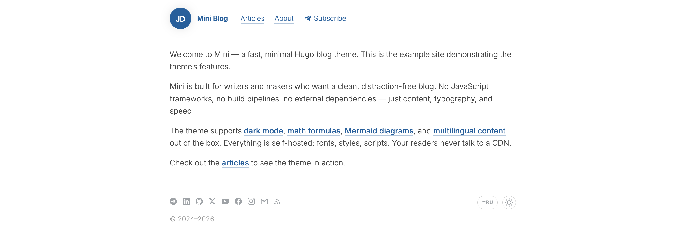

# Hugo Mini

A fast, minimal, multilingual Hugo blog theme with dark mode, Telegram integration, and dynamic OG images.

**[Live Demo](https://zavarov.com/)** · [Changelog](CHANGELOG.md) · [Contributing](CONTRIBUTING.md)



## Why Mini?

- **Writer-first.** Focus on typography and reading rhythm — no cards, no carousels, no hero sections. Everything serves the text.
- **Zero runtime dependencies.** No JavaScript framework, no CDN. One minified CSS file, one minified JS file — both fingerprinted and served from your domain.
- **Fast out of the box.** Self-hosted Inter font with preloaded weights, lazy-loaded Telegram widget, static OG images built at compile time. Lighthouse 100 is the baseline, not a goal.
- **Batteries included, opt-in.** Dark mode, i18n, math, diagrams, analytics, Telegram comments, RSS/JSON/llms.txt feeds — all shipped, all disable-able.

## Table of Contents

- [Features](#features)
- [Requirements](#requirements)
- [Installation](#installation)
- [Quick Start](#quick-start)
- [Configuration](#configuration)
  - [Minimal](#minimal)
  - [All params](#all-params)
  - [Multilingual](#multilingual)
- [Content](#content)
  - [Creating posts](#creating-posts)
  - [Front matter](#front-matter)
  - [Categories](#categories)
- [Shortcodes](#shortcodes)
- [Customization](#customization)
  - [Colors](#colors)
  - [Nav menu icons](#nav-menu-icons)
  - [Extending templates](#extending-templates)
  - [Telegram reactions](#telegram-reactions)
  - [Asset bundling](#asset-bundling)
- [Deployment](#deployment)
- [License](#license)

## Features

### Content authoring
- **Markdown-first** — standard Goldmark with `unsafe: true` for inline HTML; three shortcodes (`caption`, `mermaid`, `plug`)
- **KaTeX math** — per-page opt-in with `math = true`
- **Mermaid diagrams** — per-page opt-in with `mermaid = true`
- **Categories** — group posts on the blog listing with `categories = ["slug"]`; display names come from i18n
- **Pinned posts** — `pinned = true` floats a post to the top of its category group
- **Hidden posts** — `hidden = true` removes from listings but keeps the URL accessible (useful for drafts shared for review)
- **Code copy button** — appears on hover, with check animation
- **Heading anchor links** — clickable `#` next to `h2`/`h3` headings copies the section URL; mobile tap-to-reveal behavior included

### Reading experience
- **Dark / light mode** — follows system preference, toggleable in footer, persisted in `localStorage`
- **Recent posts sidebar** — last N posts (default 8, `params.recentSidebarCount`) shown on every single post: right-gutter sidebar on desktop, bottom block on mobile
- **Back to top** — Telegram-blog-style click area in the left gutter on wide screens; appears after scrolling past 400px
- **Responsive** — mobile overlay menu, touch-friendly footer controls, iOS-safe code block sizing
- **Accessibility** — visible focus ring, `prefers-reduced-motion` support, semantic landmarks

### Performance & SEO
- **Self-hosted assets** — Inter font (WOFF2), CSS, and JS all served from your domain; no external CDN
- **Asset bundling** — CSS and JS are minified and fingerprinted via Hugo Pipes (`/css/main.min.<sha>.css`), safe for long-cache headers
- **Dynamic OG images** — unique 1200×630 images generated per page at build time
- **SEO** — JSON-LD structured data, `hreflang`, Open Graph, Twitter Cards
- **Feeds** — JSON Feed, RSS, `llms.txt` for AI crawlers

### Integrations
- **Multilingual** — built-in i18n (ru, en) with per-language menus and footer switcher; easy to extend
- **Telegram comments** — Discussion widget, lazy-loaded, re-synced when the theme toggles
- **Telegram reactions** — view counts and emoji reactions surfaced in the post meta row; bundled fetch script reads from the public Telegram embed
- **Social sharing** — Likely buttons (Telegram, Twitter, Facebook, VK, LinkedIn), disable with `socialSharing = false`
- **Analytics** — Yandex.Metrika, Google Analytics, Plausible, Umami (cookieless options); any combination, all optional
- **Nav menu icons** — inline SVG icons on menu items via `params.icon` (built-in `telegram`)

## Requirements

Hugo Extended ≥ 0.145.0

## Installation

### Option A — Git submodule

```bash
git submodule add https://github.com/zavarovkv/hugo-mini.git themes/hugo-mini
```

Set `theme = "hugo-mini"` in your `config.toml`.

### Option B — Hugo Modules

```toml
# config.toml
[module]
  [[module.imports]]
    path = "github.com/zavarovkv/hugo-mini"
```

```bash
hugo mod get github.com/zavarovkv/hugo-mini
```

## Quick Start

```bash
# Create new site
hugo new site myblog
cd myblog

# Add theme
git submodule add https://github.com/zavarovkv/hugo-mini.git themes/hugo-mini

# Copy example config
cp themes/hugo-mini/exampleSite/config.toml .

# Create first post
hugo new blog/hello-world.md

# Start dev server
hugo server
```

## Configuration

### Minimal

```toml
baseURL = "https://example.com/"
title   = "My Blog"
theme   = "hugo-mini"

enableRobotsTXT = true
disableKinds    = ["taxonomy"]
ignoreErrors    = ["error-disable-taxonomy"]

[permalinks]
  blog = "/:slug/"

[params]
  favicon    = "images/favicon.png"
  authorName = "Jane Doe"
  authorURL  = "https://example.com/"

  [params.social]
    telegram = "https://t.me/janedoe"
    github   = "https://github.com/janedoe"
    email    = "jane@example.com"

[markup]
  [markup.goldmark.renderer]
    unsafe = true  # required for shortcodes and HTML in content

[menu]
  [[menu.main]]
    name   = "Articles"
    url    = "/blog/"
    weight = 1
```

### All params

```toml
[params]
  # Required
  favicon    = "images/favicon.png"   # relative to /static/
  authorName = "Your Name"
  authorURL  = "https://example.com/"

  # Appearance
  avatar      = "images/avatar.webp"        # header avatar (optional)
  avatarHover = "images/avatar-hover.webp"  # avatar on hover (optional)

  # Footer
  copyrightYear = 2024   # start year shown as "© 2024–CURRENT_YEAR"

  # Content
  newPostDays          = 30   # days a post shows the "New" badge (default: 30)
  recentSidebarCount   = 8    # posts shown in the recent sidebar / mobile bottom block (default: 8)

  # Telegram (all optional)
  telegramChannel = "your_channel"   # enables Discussion comments widget + reactions

  # Features
  socialSharing = true   # set false to disable Likely sharing buttons
  consoleYoda   = true   # enables a built-in Yoda ASCII art in the home-page console
  consoleArt    = "..."  # optional custom ASCII art (TOML triple-string); takes priority over consoleYoda

  # (Removed) Curated "popular posts" — replaced by the recent posts sidebar.
  # popularPosts = ["retention", "10-evils", "brandage"]

  # Analytics (all optional — omit to disable, multiple can run side by side)
  yandexMetrikaId    = 123456789      # Yandex.Metrika ID
  googleAnalyticsId  = "G-XXXXXXXXXX" # Google Analytics 4 measurement ID
  plausibleDomain    = "example.com"  # Plausible: site domain (cookieless, GDPR-friendly)
  plausibleSrc       = "https://plausible.io/js/script.js"  # optional, override for self-hosted
  umamiWebsiteId     = "00000000-0000-0000-0000-000000000000"  # Umami website ID (cookieless)
  umamiSrc           = "https://cloud.umami.is/script.js"   # optional, override for self-hosted

  # AI translation sparkle icon
  aiTranslatedLang = "en"   # show sparkle on this lang in switcher (omit to hide)

  # Schema.org Person
  [params.author]
    jobTitle = "Product Manager"

  # Social icons in footer (all optional — only set ones are rendered)
  [params.social]
    telegram  = "https://t.me/your_handle"
    linkedin  = "https://linkedin.com/in/you"
    github    = "https://github.com/you"
    x         = "https://x.com/you"
    youtube   = "https://youtube.com/@you"
    facebook  = "https://facebook.com/you"
    instagram = "https://instagram.com/you"
    email     = "you@example.com"
```

### Multilingual

```toml
defaultContentLanguage              = "ru"
defaultContentLanguageInSubdirectory = false

[languages]
  [languages.ru]
    weight       = 1
    languageCode = "ru"
    languageName = "RU"
    contentDir   = "content/ru"
    [languages.ru.params]
      description = "Мой блог"
      authorName  = "Имя Фамилия"
  [languages.en]
    weight       = 2
    languageCode = "en"
    languageName = "EN"
    contentDir   = "content/en"
    [languages.en.params]
      description = "My blog"
      authorName  = "First Last"
```

## Content

### Creating posts

```bash
hugo new blog/my-post.md
```

### Front matter

```toml
+++
title       = "My Post"
slug        = "my-post"
date        = "2026-01-01T12:00:00+03:00"
description = "Post description for SEO and listing"
categories  = ["strategy"]

# Optional
telegram_post = 42     # Telegram post number — enables Discussion comments
math          = true   # enable KaTeX math rendering
mermaid       = true   # enable Mermaid diagrams
draft         = true   # exclude from production build
hidden        = true   # build page but hide from listing
pinned        = true   # float to top of its category on the blog listing
+++
```

### Categories

Categories are slug identifiers mapped to display names via i18n. Add your own in `i18n/en.toml`:

```toml
[cat_strategy]
other = "Strategy"
```

Built-in: `marketing`, `strategy`, `metrics`, `leadership`, `self-development`, `productivity`, `collections`, `getting-started`.

## Shortcodes

| Shortcode | Description | Usage |
|---|---|---|
| `caption` | Image caption | `Text` |
| `mermaid` | Diagram block | ` ... ` |
| `plug` | Section divider `* * *` | `` |

## Customization

### Colors

The theme uses CSS custom properties. Override them in your site's `layouts/partials/extra_head.html`:

```html
<style>
  :root {
    --color-primary: #0060a0;     /* links, title, focus ring */
    --color-accent:  #d04000;     /* hover states, active elements, badges */
    --color-muted:   #9da2a6;     /* secondary text, icons at rest */
    --color-secondary: #556677;   /* mid-weight labels */
  }
  [data-theme="dark"] {
    --color-primary: #6ab0e6;
    --color-accent:  #ff7a40;
  }
</style>
```

### Nav menu icons

Add an inline SVG icon to any menu item via `params.icon`. Built-in icons: `telegram` (paper plane). On desktop the icon appears before the label with an elastic hover animation; on mobile it appears after the label.

```toml
[[languages.en.menu.main]]
  identifier = "telegram"
  name       = "Subscribe"
  url        = "https://t.me/your_channel"
  weight     = 3
  [languages.en.menu.main.params]
    icon = "telegram"
```

### Extending templates

Place files in your site's `layouts/partials/` to override theme partials:

| File | Purpose |
|---|---|
| `extra_head.html` | Additional `<head>` content — meta tags, third-party widgets |
| `header.html` | Site header |
| `custom_head.html` | Extra `<head>` content rendered **after** the bundled theme CSS, so overrides win the cascade |
| `custom_body.html` | Extra `<script>`/markup at the end of `<body>`, rendered **after** the bundled theme JS |

### Telegram reactions

The theme can surface view counts and emoji reactions from your Telegram channel into each post's meta row (next to the date). Enable it in three steps:

1. **Set `params.telegramChannel`** in your `config.toml` if you haven't already:
   ```toml
   [params]
     telegramChannel = "your_channel"   # without @
   ```

2. **Tag each post** that has a corresponding Telegram channel post with `telegram_post = NNN` in front matter (`NNN` = the message ID in the channel):
   ```toml
   +++
   title = "My Post"
   telegram_post = 42
   +++
   ```

3. **Wire the fetch script** into your site's `package.json` and run it before every Hugo build:
   ```json
   "scripts": {
     "fetch-telegram-reactions": "node themes/hugo-mini/scripts/fetch-telegram-reactions.mjs"
   }
   ```

   Add the generated data file to `.gitignore`:
   ```
   /data/telegram_reactions.json
   ```

   And call it in CI before `hugo --minify`:
   ```yaml
   - name: Fetch Telegram reactions
     continue-on-error: true
     run: npm run fetch-telegram-reactions
   - name: Build
     run: hugo --minify
   ```

The script auto-resolves the channel and content directory via `hugo config --format json`, so no CLI flags are needed in the common case. It scrapes each post's public Telegram embed (`https://t.me/<channel>/<id>?embed=1`), parses reaction + view counts, and writes `data/telegram_reactions.json` which the theme partials `telegram-views.html` and `telegram-reactions.html` consume at build time. Missing data is handled gracefully — local dev builds without running the script still work.

Overrides for the common case:

```bash
node themes/hugo-mini/scripts/fetch-telegram-reactions.mjs \
  --channel my_channel \
  --content-dir content/en/posts \
  --output data/tg.json
```

Also respects the `TELEGRAM_CHANNEL` env var. Requires Hugo Extended on PATH (for the config dump) and Node 18+ (for native `fetch` / `parseArgs`).

### Asset bundling

Theme CSS and JS live as source files in `themes/hugo-mini/assets/`:

- `assets/css/main.css` — bundled theme stylesheet (typography, palette, components, dark mode, fonts)
- `assets/js/main.js` — bundled theme JS (theme toggle, code-copy button, heading anchor copy, mobile menu, recent-posts sidebar positioning, back-to-top)

`baseof.html` runs them through Hugo Pipes:

```go-template
{{ $css := resources.Get "css/main.css"
   | resources.ExecuteAsTemplate "css/main.css" .
   | resources.Minify
   | resources.Fingerprint "sha256" }}
<link rel="stylesheet" href="{{ $css.RelPermalink }}" integrity="{{ $css.Data.Integrity }}">
```

The result is a minified, content-hashed file at `/css/main.min.<sha>.css` — safe to send long-cache headers, since the URL changes whenever the content changes. Same pattern for JS, with the bundle name including `.Language.Lang` so multilingual sites get one bundle per language (`main.en.min.<sha>.js`, `main.ru.min.<sha>.js`) — necessary because i18n strings are baked in at build time.

## Deployment

### GitHub Pages

```yaml
# .github/workflows/deploy.yml
name: Deploy
on:
  push:
    branches: [main]
jobs:
  deploy:
    runs-on: ubuntu-latest
    steps:
      - uses: actions/checkout@v4
        with:
          submodules: true
      - uses: peaceiris/actions-hugo@v3
        with:
          hugo-version: latest
          extended: true
      - run: hugo --minify
      - uses: peaceiris/actions-gh-pages@v4
        with:
          github_token: ${{ secrets.GITHUB_TOKEN }}
          publish_dir: ./public
```

### Netlify / Vercel

Set build command to `hugo --minify`, publish directory to `public`. Set environment variable `HUGO_VERSION` to `latest` and ensure **Hugo Extended** is used.

## License

[MIT](LICENSE)
